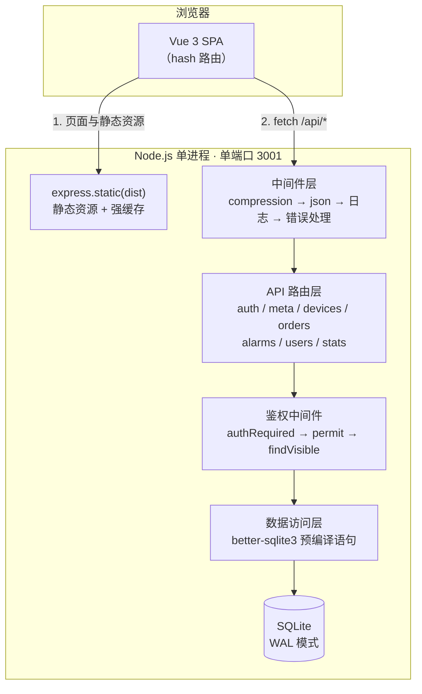
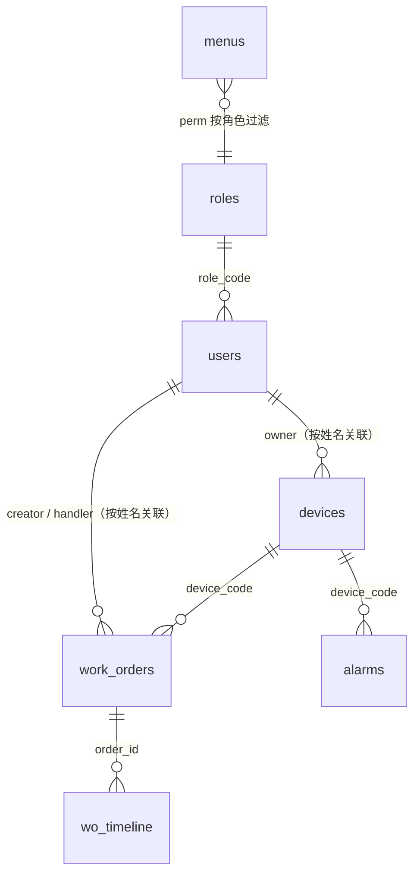
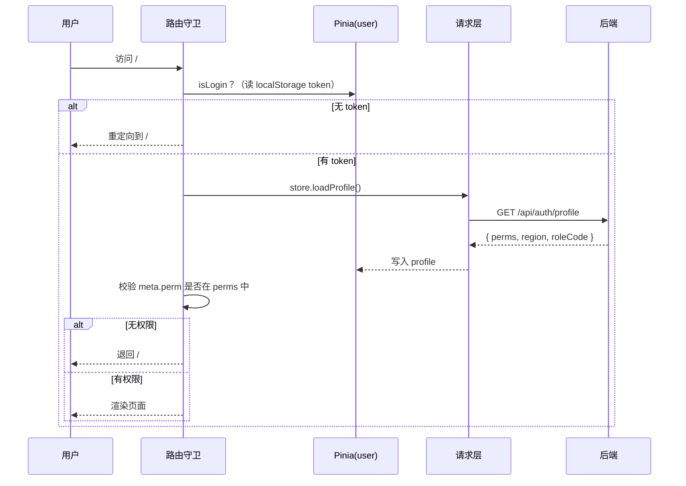
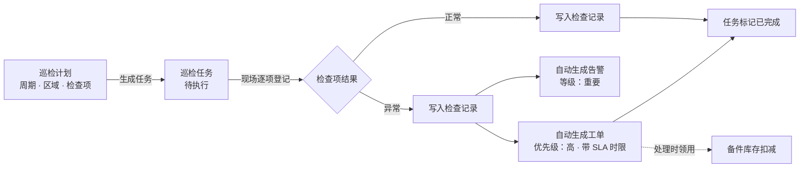
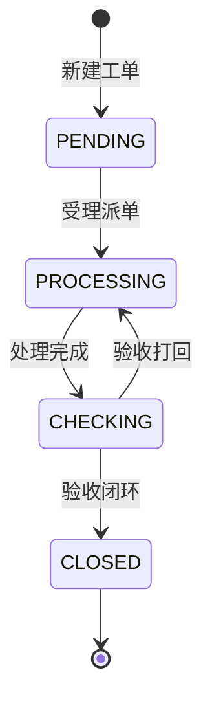

# 项目架构说明

> 园区综合运维管理平台 · 个人作品 Demo
> 一个人从需求到上线的完整实现：Vue3 + TypeScript + Vite（前端） / Node.js + Express + SQLite（后端）

本文说明项目的整体分层、模块职责、关键设计与实现取舍。所有描述均与仓库代码一一对应。

---

## 一、项目概览

| 项目 | 说明 |
|---|---|
| 业务定位 | 面向园区 / 厂区 / 政企单位的中后台运维管理系统 |
| 核心能力 | 设备台账、**巡检管理**、工单流转与 **SLA 时效**、告警处置、**备件库存**、报表统计、RBAC 权限、系统管理 |
| 代码规模 | 前后端业务代码合计约 5000 行（不含自测脚本与锁文件） |
| 运行形态 | **单端口服务**：Express 同时提供 `/api/*` 接口与 `dist/` 静态资源 |
| 数据来源 | 全部为脚本随机生成的模拟数据，不含任何真实业务信息 |

**为什么是单端口**：前后端同源可以一次性消除跨域配置、Cookie/SameSite 策略、HTTPS 证书混用这三类部署期问题。代价是静态资源由 Node 托管（性能不如 Nginx），后续接 Nginx 反代即可解决。

---

## 二、整体架构



请求生命周期（以 `GET /api/devices` 为例）：

```
请求
 └→ compression      按 Accept-Encoding 决定是否 gzip 输出
 └→ express.json     解析请求体；非法 JSON 直接转 400（不落到 500）
 └→ 请求日志         记录 method + path，便于演示时观察调用链
 └→ authRequired     解析 Bearer Token → 校验签名 → 注入 req.user（含 perms / scope）
 └→ 路由处理         用 scopeFilter 生成数据范围 WHERE 条件 → 分页查询
 └→ 响应             { code: 0, data: {...} }
 └→ （异常时）统一错误处理 → { code: 500, message }
```

---

## 三、目录结构与职责

```
demo-park-ops/
├── server/                        # 后端（ESM）
│   ├── app.js                     # 应用入口：中间件装配、路由挂载、静态托管、统一错误处理
│   ├── db.js                      # SQLite 连接（WAL）、建表 DDL 与增量列迁移
│   ├── seed.js                    # 演示数据生成，导出 runSeed(quiet) 供复用
│   ├── bootstrap.js               # 启动自举：库为空则自动 seed，保证容器重建后开箱即用
│   ├── middleware/
│   │   └── auth.js                # JWT 签发/校验、权限点校验、数据范围过滤、可见性查询、操作日志
│   ├── routes/                    # 按业务域拆分，每个文件一个 Router
│   │   ├── auth.js                # 登录 / 当前用户
│   │   ├── meta.js                # 菜单树 / 角色 / 数据字典 / 操作日志 / 派单人员
│   │   ├── devices.js             # 设备台账 CRUD + 统计 + 保养到期
│   │   ├── inspection.js          # 巡检计划 / 任务 / 执行提交 / 统计
│   │   ├── orders.js              # 工单 CRUD + 状态机 + 派单 + SLA 时效
│   │   ├── alarms.js              # 告警列表 + 处置 + 分布/趋势
│   │   ├── parts.js               # 备件台账 + 出入库 + 工单领用 + 低库存预警
│   │   ├── users.js               # 用户管理
│   │   └── stats.js               # 首页看板聚合统计
│   └── utils/
│       ├── validate.js            # 分页 / 关键词等入参安全解析
│       ├── time.js                # 时间口径统一（东八区时间字符串）
│       └── sla.js                 # SLA 时限计算与超时判定
│
├── src/                           # 前端（Vue 3 + TS）
│   ├── main.ts                    # 应用启动：挂载 Pinia、路由、naive-ui 全局消息与对话框
│   ├── App.vue                    # 根组件（Provider 包装）
│   ├── router/index.ts            # 路由表 + 全局前置守卫（登录态 + 权限点）
│   ├── store/user.ts              # Pinia 用户态：token 持久化、profile、注销
│   ├── api/index.ts               # 统一请求封装 + 业务接口定义
│   ├── layouts/BasicLayout.vue    # 侧边栏 + 顶栏骨架，菜单由后端按角色下发
│   ├── components/EChart.vue      # ECharts 封装：自适应 resize + 卸载销毁
│   ├── utils/
│   │   ├── echarts.ts             # ECharts 按需注册（只注册用到的图表与组件）
│   │   └── excel.ts               # Excel 导入导出（exceljs 动态加载）
│   ├── views/                     # 登录 / 看板 / 设备 / 巡检 / 工单 / 告警 / 备件 / 报表 / 系统管理×4
│   └── styles/global.css          # 全局样式（含打印样式）
│
├── scripts/
│   ├── self-test.mjs              # 接口自测：69 项断言，覆盖越权 / 业务规则 / 边界
│   └── smoke-ui.mjs               # 前端冒烟：无头浏览器逐页检查元素、控制台报错与 4xx + 截图
│
├── eslint.config.js               # ESLint 9 flat config（JS/TS/Vue）
├── vite.config.ts                 # 构建配置：路径别名、开发代理、手动分包
├── tsconfig.json                  # TypeScript 严格模式
├── Dockerfile / .dockerignore     # 容器化部署
├── ecosystem.config.cjs           # PM2 部署（fork 单实例）
├── .env.example                   # 环境变量契约
├── DEPLOY.md                      # 三种部署方案 + 排障
├── ARCHITECTURE.md / BUILD-ANALYSIS.md
└── README.md                      # 项目说明与快速开始
```

---

## 四、后端设计

### 4.1 分层与依赖方向

```
routes（业务编排）
   ↓ 依赖
middleware（横切关注点：鉴权、权限、日志）
   ↓ 依赖
utils / db（通用能力与数据访问）
```

反向依赖不存在。路由层不直接拼权限逻辑，而是统一调用中间件导出的 `scopeFilter` / `findVisible`，保证权限规则只有一处定义。

### 4.2 数据模型



| 表 | 用途 | 关键约束 |
|---|---|---|
| `roles` | 角色与数据范围 | `code` 唯一 |
| `menus` | 菜单树（后端下发） | `parent_id=0` 为一级，`perm` 关联权限点 |
| `users` | 用户 | `username` 唯一，`password` 存 bcrypt 哈希 |
| `devices` | 设备台账 | `code` 唯一；`region` / `owner` 是数据范围的过滤字段；含保养周期与下次保养日期 |
| `work_orders` | 工单 | `code` 唯一；`status` 受状态机约束；含响应/处理时限（SLA）与响应时间 |
| `wo_timeline` | 工单流转记录 | 每次流转追加一条，不覆盖 |
| `alarms` | 告警 | `level` / `status` / `region` 为常用筛选字段 |
| `inspection_plans` | 巡检计划 | `items` 以 JSON 存检查项；`cycle` 决定巡检周期 |
| `inspection_tasks` | 巡检任务 | `code` 唯一（编号含日期）；`abnormal` 记录异常项数 |
| `inspection_records` | 巡检检查记录 | 每个检查项一条，`result` 为正常 / 异常 |
| `parts` | 备件台账 | `code` 唯一；`stock < safety_stock` 即触发低库存预警 |
| `part_records` | 备件出入库流水 | 记录前后库存，可与工单号关联，保证可追溯 |
| `dicts` | 数据字典 | 下拉选项统一维护，避免前端硬编码 |
| `logs` | 操作日志 | 记录登录、增删改、工单流转、巡检执行、备件出入库等动作 |

**设计取舍**：表间不使用物理外键，改用逻辑关联 + 应用层校验。原因是 SQLite 的外键约束在批量 seed 时需要严格控制插入顺序，且删设备时不应级联删工单（历史工单要保留）。已建索引：`devices.region`、`work_orders.status`、`alarms.level`。

### 4.3 权限模型（本项目核心）

权限分三层，缺一层就会出现越权口子：

| 层次 | 控制对象 | 实现位置 | 表现 |
|---|---|---|---|
| **菜单权限** | 能不能看到入口 | 后端 `GET /api/meta/menus` 按角色过滤 | 非管理员看不到「系统管理」 |
| **操作权限** | 能不能执行动作 | 后端 `permit('device:edit')` + 前端路由 meta.perm | 专员调新增设备接口返回 403 |
| **数据范围** | 能看到哪些数据 | 后端 `scopeFilter()` 下沉到 SQL WHERE | 同一张表，三角色看到的行数不同 |

```js
// 角色 → 数据范围
const ROLE_SCOPE = { admin: 'ALL', manager: 'REGION', operator: 'SELF' }

export function scopeFilter(table, user) {
  if (user.scope === 'ALL') return { sql: '1=1', params: [] }
  if (user.scope === 'REGION') return { sql: 'region = ?', params: [user.region] }
  // SELF：工单看处理人、设备看负责人、告警看本区域
  if (table === 'work_orders') return { sql: 'handler = ?', params: [user.real_name] }
  if (table === 'devices') return { sql: 'owner = ?', params: [user.real_name] }
  ...
}
```

实测差异（同一份数据、同一张表；演示数据由脚本随机生成，具体数值每次会浮动）：

| 账号 | 角色 | 数据范围 | 可见设备 | 可见巡检任务 | 可见工单 |
|---|---|---|---|---|---|
| admin | 系统管理员 | ALL | 200 | 51 | 500 |
| manager | 运维主管 | REGION（一号产业园） | 40 | 18 | 118 |
| operator | 运维专员 | SELF（仅本人负责） | 30 | 8 | 95 |

> 巡检任务的 SELF 口径是「我负责的巡检任务」（`inspector`），与设备的「我负责的设备」（`owner`）一致，都通过同一套 `scopeFilter` 实现，没有为巡检单独写一套过滤逻辑。

> `region` 必须写进 JWT。早期版本只在登录响应里返回 region 而未写入 Token，导致服务端 `req.user.region` 为 undefined，地区过滤**静默失效**（接口不报错，但所有人都能看到全部数据）。这类问题不会在功能测试中暴露，只会体现在数据上。

**越权防护的一个细节**：详情 / 编辑 / 删除 / 流转接口如果只按 `id` 查询，知道 id 就能操作任意数据。本项目统一用 `findVisible()`——把数据范围条件拼进查询本身：

```js
export function findVisible(table, id, user, fields = '*') {
  const sc = scopeFilter(table, user)
  return db.prepare(`SELECT ${fields} FROM ${table} WHERE id = ? AND ${sc.sql}`)
    .get(id, ...sc.params)
}
```

越权访问与记录不存在返回**同一个结果**（404），避免通过状态码差异探测资源是否存在。

#### 权限点清单

| 模块 | 权限点 | admin | manager | operator |
|---|---|:---:|:---:|:---:|
| 看板 | `dashboard:view` | ✓ | ✓ | ✓ |
| 设备 | `device:view` / `device:edit` | ✓ / ✓ | ✓ / ✓ | ✓ / — |
| 巡检 | `inspection:view` / `inspection:edit`（现场执行） | ✓ / ✓ | ✓ / ✓ | ✓ / ✓ |
| 巡检 | `inspection:plan`（计划维护） | ✓ | ✓ | — |
| 工单 | `order:view` / `order:edit` | ✓ / ✓ | ✓ / ✓ | ✓ / ✓ |
| 告警 | `alarm:view` | ✓ | ✓ | ✓ |
| 备件 | `part:view` / `part:edit` | ✓ / ✓ | ✓ / ✓ | ✓ / — |
| 报表 | `report:view` | ✓ | ✓ | — |
| 系统 | `system:user` / `system:role` / `system:dict` / `system:log` | ✓ | — | — |

> **一处权限粒度的修正**：最初「现场执行巡检」与「维护巡检计划」共用了同一个 `inspection:edit`，
> 导致运维专员可以删除巡检计划——典型的权限粒度太粗。现已拆成
> `inspection:edit`（执行）与 `inspection:plan`（维护）两个权限点。
> 这个问题是接口自测跑出来的，不是靠人工点页面发现的。

### 4.4 中间件与统一约定

| 中间件 | 职责 |
|---|---|
| `compression` | 按 `Accept-Encoding` 压缩响应，实测 naive-ui 包 1.39MB → 377KB |
| `express.json` | 解析请求体；解析失败由紧随其后的错误中间件转成 **400**，不落 500 |
| 请求日志 | 打印 `METHOD /path`，演示时可直观看到前后端调用链 |
| `authRequired` | 解析 Bearer Token、验签、注入 `req.user`（含 perms / scope） |
| `permit(...)` | 权限点校验，不满足返回 403 |
| 统一错误处理 | 兜底异常转 JSON；注意 Express 靠**形参个数为 4** 识别错误中间件 |
| API 兜底 404 | 未匹配的 `/api/*` 返回 JSON，否则前端会拿到 HTML 并解析失败 |

**响应约定**：成功 `{ code: 0, data }`，失败 `{ code: 非0, message }` + 对应 HTTP 状态码。前端请求层据此统一解包与提示。

---

## 五、前端设计

### 5.1 启动与渲染流程



### 5.2 路由与权限守卫

- 使用 **hash 模式**：静态托管无需服务端 rewrite 配置，避免 Nginx `try_files` 配错导致刷新 404。
- 路由 `meta.perm` 声明所需权限点，守卫统一校验，页面组件内不再散落判断。
- 菜单不写死在前端，由 `GET /api/meta/menus` 按角色下发，前端用后端返回的 `icon` 字段映射到**内联 SVG**（不引图标库，避免为首屏增加体积）。

### 5.3 状态管理

只用一个 Pinia store（`user`），因为只有「登录态」是真正的全局状态。页面数据各自用组件内 `ref` 持有，接口返回即渲染，不做全局缓存——中后台页面切换频繁且数据要求实时，全局缓存反而增加失效逻辑的复杂度。

### 5.4 请求层

`src/api/index.ts` 统一封装：自动附带 Token、统一解包 `{code,data,message}`、401 自动登出并跳登录页、GET 自动拼查询串（过滤空值）。

### 5.5 组件划分

- `BasicLayout`：侧边栏 + 顶栏骨架，角色标签与数据范围提示常驻，方便演示权限差异。
- `EChart.vue`：只做三件事——初始化、监听 `option` 变化重绘、卸载时 `dispose`；同时监听 window resize 自适应。
- 业务页面按模块独立成文件，路由级懒加载。

---

## 六、关键流程

### 6.3 巡检业务闭环（本项目的业务主线）

这是把「设备台账 / 工单 / 告警 / 备件」串起来的核心流程：



**为什么异常要自动建单**：真实运维里「巡检发现问题 → 填单 → 派单」是重复劳动，
且容易漏。这里把「异常」作为触发器，一次提交同时产出告警与带 SLA 时限的工单，
并把来源（巡检任务号）写进工单时间轴，保证可追溯。整个提交放在一个数据库事务里，
要么全部成功要么全部回滚，不会出现「记录写了但工单没建」的中间态。

### 6.4 备件与工单联动

- **领用即扣减**：工单详情里选择备件与数量，服务端先校验库存是否充足，不足直接拒绝并告知当前库存，避免出现负库存。
- **流水自洽**：每次出入库都会记录 `before_stock → after_stock`，并与工单号关联。所以任何一条库存数字都能回溯到具体是谁、因为哪张工单、在什么时间改的。
- **预警口径统一**：`stock < safety_stock` 这个判断同时用于列表筛选、统计卡片和首页预警，全部下沉到 SQL，不会出现「列表说低库存、统计说正常」的口径分歧。

### 6.5 工单 SLA 时效

| 优先级 | 响应时限 | 处理时限 |
|---|---|---|
| 高 | 2 小时 | 8 小时 |
| 中 | 8 小时 | 24 小时 |
| 低 | 24 小时 | 72 小时 |

- 工单创建时即写入两个时限；首次受理时记录 `responded_at`。
- **超时不落库为唯一依据**：列表里的超时标记是**实时算出来的**（拿当前时间与处理时限比较），库里的 `overdue` 字段只作为便于筛选的冗余。否则一条三天未处理的工单，其「超时」状态会随时间失真。
- 超时工单在列表中自动置顶，支持「仅看超时」筛选，首页有独立的超时工单卡片。

### 6.6 时间口径（一个容易踩的坑）

全项目统一使用**东八区时间字符串**（`YYYY-MM-DD HH:mm:ss`）作为业务时间，集中在 `server/utils/time.js`。

早期版本用 `new Date().toISOString()` 直接落库——那是 UTC，而 SLA 计算按 `+08:00` 解析，
两者混用会让超时判定整体偏移 8 小时：页面显示的时间比实际早 8 小时，且明明没超时的工单被标记为超时。
这类问题不会报错，只会让数据看起来「有点怪」，很难通过功能测试发现。

### 6.7 工单状态机



流转规则集中在后端 `FLOW` 常量中，非法流转（如待受理直接跳到已闭环）返回 400 并说明原因。每次流转向 `wo_timeline` 追加一条记录，形成可追溯的时间轴，而不是覆盖式更新。

### 6.8 数据范围过滤

所有列表 / 统计接口都遵循同一模式：`scopeFilter()` 生成 WHERE 条件 → 拼进 SQL → 分页查询。因为过滤发生在 SQL 层而不是取出数据后再筛，所以分页总数与列表数据天然一致，不会出现「第一页 20 条、总数只算 5 条」的错位。

### 6.9 Excel 导入导出

- **导出**：按当前数据权限取全量 → exceljs 生成带表头样式与边框的工作簿 → Blob 触发下载。
- **导入**：逐行解析并校验，失败时**回显具体行号与原因**，而不是整批失败。
- **exceljs 动态加载**：该库压缩后约 940KB，改为点击导入/导出时才 `import()`，不进入首屏。

### 6.10 启动自举

`server/bootstrap.js` 在服务启动前检查 `users` 表：为空则自动执行 seed。这样容器重建、数据卷被清空、或首次往新服务器部署时都不需要人工再跑一次 `npm run seed`。

---

## 七、技术选型与取舍

| 选择 | 理由 | 代价 / 取舍 |
|---|---|---|
| Vue 3 + `<script setup>` | 组合式 API 逻辑内聚，TS 推断好 | — |
| TypeScript 严格模式 | 接口字段拼写、可选链错误在编译期暴露 | 类型定义有额外成本 |
| Vite | 冷启动快、构建配置简单、生态成熟 | — |
| Pinia | Vue 官方推荐，体积小 | — |
| Naive UI | 组件全、TS 友好、CSS-in-JS 无需引入样式文件 | 打包体积偏大（1.39MB），是当前最大产物 |
| ECharts | 功能覆盖全，图表类型可扩展 | 全量引入约 1MB，已改为按需注册 |
| **不套用现成后台框架** | 展示从零搭建能力：布局、守卫、请求层、权限模型均为手写 | 开发量更大，但每处设计都能讲清为什么 |
| Express + better-sqlite3 | 零外部依赖、单文件数据库、部署即用 | 不适合多实例水平扩展（SQLite 写锁） |
| hash 路由 | 静态托管零配置 | URL 带 `#`，观感略逊 |

**模块划分上的一处取舍**：巡检与备件做成独立模块，而不是把字段塞进工单表。
原因是这两者都有各自独立的生命周期——巡检计划会长期存在并周期性产生任务，备件库存独立于工单持续变动。
硬塞进工单会导致「大部分字段长期为空」且无法表达「一张工单领用多个备件」。
模块之间通过**工单号**这一业务主键关联（备件流水记 `order_code`、巡检异常建单时写入来源任务号），
而不是数据库物理外键，这样各模块可以独立演进。

---

## 八、部署架构

项目已具备三种部署形态，详见 `DEPLOY.md`：

```
方案 A（容器）     浏览器 → Docker(node:22-slim) → 卷 /data/data.db
方案 B（直部署）   浏览器 → Nginx(443/证书) → PM2 fork 单实例(node) → ./server/data.db
方案 C（托管平台） 浏览器 → 平台反向代理 → 容器内单端口服务
```

三种方案的共同前提：**单端口输出**（API 与静态资源同源）。环境变量契约统一为 `PORT` / `DB_PATH` / `JWT_SECRET`。

> 注意：SQLite 多进程写会锁冲突，因此 PM2 必须用 `fork` 模式且 `instances: 1`，不能用 cluster。

---

## 九、已知边界与后续规划

**当前边界**

- 单实例部署，SQLite 不支持多副本水平扩展。
- 登录无失败次数限制与验证码，公网暴露前应补上。
- 权限点与角色映射写在代码常量中；若要支持运行时自定义角色权限，需要落库（`roles` 表已有 `data_scope` 字段，扩展点已预留）。
- 巡检任务目前是**手动触发**生成当日任务（页面上有「生成今日任务」按钮），未接定时调度；真实场景用 cron 定时调用同一接口即可。
- 工单 SLA 只做到「标记与提醒」，未实现超时自动升级（如超时后逐级上报）。

**后续规划**

1. 巡检任务的定时生成（cron / 调度中心调用现有接口即可）
2. 工单超时自动升级与消息通知
3. 表格列配置持久化、列表筛选条件写入 URL（可分享、可回退）
4. 组件级单元测试（当前为接口自测 69 项 + 无头浏览器冒烟 12 个路由）
5. 接入 CI：push 时自动跑 lint / typecheck / 构建 / 自测
